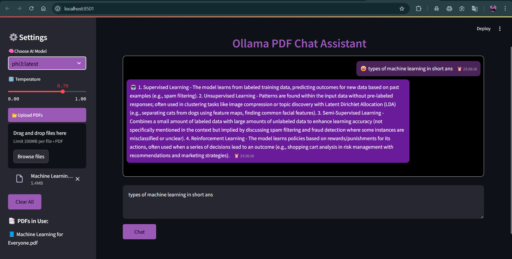

# Ollama PDF Chat Assistant

Ollama PDF Chat Assistant is a Streamlit-based application that allows users to upload PDF files and interact with them using AI-powered chat. It utilizes Ollama LLM for generating responses and FAISS for efficient document retrieval.

## Features🌟

- 📂 **Upload and Process PDFs**: Extract text from PDFs and create embeddings.
- 🤖 **AI-Powered Chat**: Ask questions about the uploaded PDFs using a retrieval-based chat system.
- 🧠 **Customizable AI Model**: Select from available Ollama models.
- 🎛️ **Temperature Control**: Adjust response creativity with a temperature slider.
- 📑 **Chat History**: Keeps track of past interactions.
- 🎨 **Custom UI**: Modern and visually appealing chat interface.
- 🔄 **Automatic PDF Processing**: Automatically processes newly uploaded PDFs.
- ⚡ **Efficient Search & Retrieval**: Uses FAISS for quick and accurate document retrieval.

## Demo 🤖 



## Tech Stack 🛠️

- **Frontend**: Streamlit (for UI and interactivity)
- **Backend**: LangChain, Ollama LLM
- **PDF Processing**: PyMuPDF (Fitz)
- **Vector Search**: FAISS (Facebook AI Similarity Search)
- **Embedding Model**: Ollama Embeddings
- **Styling**: Custom CSS for improved UI

## Version History 🔂

 **💡 USE THE LATEST VERSION `app4.py`** 
- **Version-1 (`app.py`) :** Initial version with basic PDF uploading and chat functionality.

- **Version-2 (`app2.py`) :** Integrated FAISS vector search for efficient document retrieval.

- **Version-3 (`app3.py`) :**

   1. *Enhanced UI with custom chat styling.*

   2. *Added model selection from available Ollama models.*

   3. *Improved document chunking for better query response.*

   4. *Introduced session-based persistent chat history.* 


- **Version-4  (Latest) (`app4.py`) :**

   1. *Optimized processing speed and memory efficiency.*

   2. *Enhanced chat history rendering with real-time updates.*

   3. *Added the ability to clear uploaded PDFs and embeddings.*

   4. *Improved PDF extraction and vector storage logic.*


## Installation ⬇️

### ⚠️ Prerequisites
Ensure you have the following installed:
- Python 3.10+
- pip
- [**Ollama**](https://ollama.com/) (**Installed and running locally**)

### Setup 🧑‍🔧
1. Clone the repository:
   ```sh
   git clone https://github.com/A3x-parvez/PDF_Chat_AI.git
   ```

2. Activate the virtual environment (recommended):
   ```sh
   pdf_chat\Scripts\activate 
   ```

3. Install dependencies(if needed / or virtual environment not worked):
   ```sh
   pip install -r requirements.txt
   ```

4. Run the Streamlit app:
   ```sh
   streamlit run app4.py
   ```

## Usage 🎯

1. Open the application in a browser.
2. Upload one or more PDF files.
3. Select the AI model from the sidebar.
4. Adjust the temperature setting if needed.
5. Enter a question related to the PDFs and click "Chat."
6. View AI-generated responses in the chat window.

## Technologies Used⚡

- **Streamlit**: For the web interface.
- **PyMuPDF (Fitz)**: To extract text from PDFs.
- **FAISS**: For vector search and retrieval.
- **LangChain**: To integrate AI models and create the chat pipeline.
- **Ollama**: For AI-powered responses.

## Customizations⚒️

- Modify `st.session_state` to enhance session handling.
- Adjust chunk sizes in `RecursiveCharacterTextSplitter` to optimize document segmentation.
- Customize the UI further in the `st.markdown()` sections using CSS.

## Contribution🤝

Feel free to fork and submit pull requests! If you encounter issues, open a GitHub issue.

## Contact☎️

For inquiries or support, reach out via:
- 📧 Email: rijwanoolkarim143r@gmail.com
- 🐦 Linkedin: [Rijwanool Karim](https://www.linkedin.com/in/rijwanool-karim)
- 📘 GitHub Issues: [A3x-Parvez](https://github.com/A3x-parvez)

## Acknowledgments👍

Special thanks to the open-source community and ollama for building amazing AI tools! 🚀

